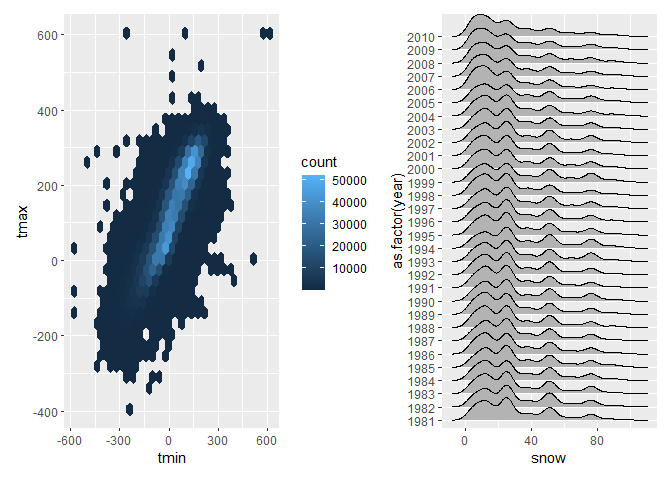
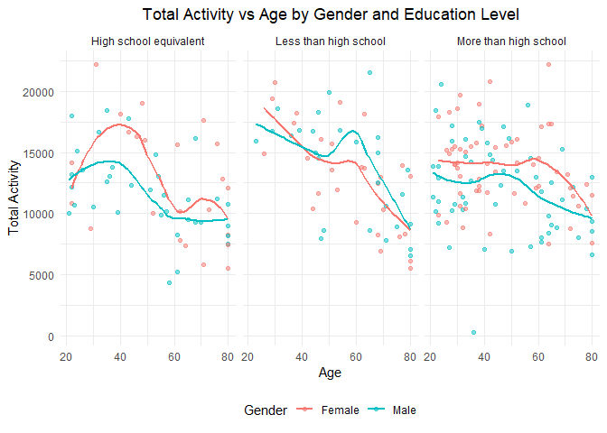

HW3_yh3683
================
Yining He
2024-10-08

# Problem 1

devtools::install_github(“p8105/p8105.datasets”)

The dataset has 2595176 observation and 7 variables. The key variable in
the dataset are id, date, prcp, snow, snwd, tmax, tmin.

    ## # A tibble: 1 × 5
    ##   prcp_missing snow_missing snwd_missing tmax_missing tmin_missing
    ##          <dbl>        <dbl>        <dbl>        <dbl>        <dbl>
    ## 1       0.0562        0.147        0.228        0.437        0.437

The ny_noaa dataset shows 5.6% missing values for precipitation, 14.7%
for snowfall, 22.8% for snow depth, and 43.7% missing for both maximum
and minimum temperatures. This high level of maximum and minmun
temeratures missingness, , may impact temperature trend analysis.

    ## # A tibble: 6 × 2
    ##    snow       n
    ##   <dbl>   <int>
    ## 1     0 2008508
    ## 2    25   31022
    ## 3    13   23095
    ## 4    51   18274
    ## 5    76   10173
    ## 6     8    9962

The most frequently recorded snowfall amount is 0 mm, with 2,008,508
occurrences, which indicates that snow was absent on most days in this
dataset.

# Problem 2

The cleaned_datat has 228 observation and 1445 variables, after we
cleaned and merged the data.

<!-- -->
This violin plot shows age distributions by gender across three
education levels: “High school equivalent,” “Less than high school,” and
“More than high school.” Wider sections indicate higher age density,
with blue dots marking medians. Both genders in “High school equivalent”
have a uniform age spread around a median of 60, while “Less than high
school” shows a broader age range, especially for males. The “More than
high school” group has a younger, more concentrated age distribution,
particularly among females. Overall, those with higher education tend to
be younger, while “Less than high school” shows greater age variability.

``` r
# creat the plot
ggplot(agr_data, aes(x = age, y = total_activity, color = sex)) +
  geom_point(alpha = 0.5) + 
  geom_smooth(method = "loess", se = FALSE) +  # Add smooth trend lines
  facet_wrap(~education) +  
  labs(
    title = "Total Activity vs Age by Gender and Education Level",
    x = "Age",
    y = "Total Activity",
    color = "Gender"
  ) +
  theme_minimal() +
  theme(
    legend.position = "bottom",
    plot.title = element_text(hjust = 0.5)
  )
```

    ## `geom_smooth()` using formula = 'y ~ x'

<!-- -->
This plot shows total activity decreasing with age across education
levels, with notable differences by gender. In the “High school
equivalent” group, men’s activity drops sharply around age 50 from about
15,000 to 10,000, while women decline more gradually. For those with
“Less than high school” education, men’s activity falls steeply from
around 13,000 in their 20s to below 5,000 by age 70, whereas women drop
more steadily to about 7,000. The “More than high school” group
maintains stable activity near 12,000 until age 50, then declines to
around 8,000, with women showing more consistency than men. Higher
education is associated with more stable activity levels across ages.
