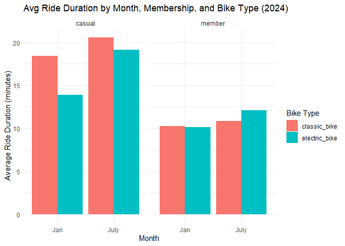

HW3_yh3683
================
Yining He
2024-10-08

# Problem 1

devtools::install_github(“p8105/p8105.datasets”)

``` r
data("ny_noaa")
```

The dataset has 2595176 observation and 7 variables. The key variable in
the dataset are id, date, prcp, snow, snwd, tmax, tmin.

The ny_noaa dataset shows 5.6% missing values for precipitation, 14.7%
for snowfall, 22.8% for snow depth, and 43.7% missing for both maximum
and minimum temperatures. This high level of maximum and minmun
temeratures missingness, , may impact temperature trend analysis.

    ## # A tibble: 6 × 2
    ##    snow       n
    ##   <dbl>   <int>
    ## 1     0 2008508
    ## 2    25   31022
    ## 3    13   23095
    ## 4    51   18274
    ## 5    76   10173
    ## 6     8    9962

The most frequently recorded snowfall amount is 0 mm, with 2,008,508
occurrences, which indicates that snow was absent on most days in this
dataset.

#### Answer questions about the data(Answers)

``` r
data("ny_noaa")
```

This dataset contains 2595176 rows and 7 columns. Variables include
weather station id, date of observation, (tenths of mm), snowfall (mm),
snow depth (mm), and min and max temperature (tenths of degrees C).

Below we clean the data, creating separate variables for year, month,
and day and converting `tmax` and `tmin` to numeric. We find that 0 is
the most commonly observed value for snowfall. This is because most days
of the year, it does not snow at all in NY. The second most commonly
observed value is `NA`, indicating missingness. Other common values are
13, 25, and 51, suggesting that snowfall is originally recorded in
fractions of an inch and converted to mm.

``` r
ny_noaa %>% 
  count(snow) %>%
  arrange(desc(n))
```

    ## # A tibble: 282 × 2
    ##     snow       n
    ##    <int>   <int>
    ##  1     0 2008508
    ##  2    NA  381221
    ##  3    25   31022
    ##  4    13   23095
    ##  5    51   18274
    ##  6    76   10173
    ##  7     8    9962
    ##  8     5    9748
    ##  9    38    9197
    ## 10     3    8790
    ## # ℹ 272 more rows

``` r
ny_noaa = 
  ny_noaa %>% 
  separate(date, into = c("year", "month", "day"), convert = TRUE) %>% 
  mutate(
    tmax = as.numeric(tmax),
    tmin = as.numeric(tmin))
```

``` r
ny_noaa %>% 
  group_by(id, year, month) %>% 
  filter(month %in% c(1, 7)) %>% 
  summarize(mean_tmax = mean(tmax, na.rm = TRUE, color = id)) %>% 
  ggplot(aes(x = year, y = mean_tmax, group = id)) + geom_point() + geom_path() +
  facet_grid(~month) +
  labs(title = "Mean monthly temperature for each station across years for January and July")
```

    ## `summarise()` has grouped output by 'id', 'year'. You can override using the
    ## `.groups` argument.

    ## Warning: Removed 5970 rows containing missing values or values outside the scale range
    ## (`geom_point()`).

    ## Warning: Removed 5931 rows containing missing values or values outside the scale range
    ## (`geom_path()`).

<!-- -->

Below we show a two-panel plot including (i) a hex plot of `tmax` vs
`tmin` for the full dataset; and (ii) a ridge plot showing the
distribution of snowfall values (in mm) greater than 0 and less than 100
separately by year.

From the hex plot we see that while there is some variability, the
majority of the data cluster tightly in the center of the distribution.
In relatively rare cases, it seems that `tmax` is less than `tmin`,
which raises questions about data recording and quality.

From the ridge plot, we see a multimodal density of snowfall within a
given year. Most stations see between 0 and 35 mm of snow in a year.
Then there is a another group of stations that see about 45 mm of snow,
and another group that sees nearly 80 mm. It is likely this
multimodality stems from the conversion of measurements in one system
(fractions of an inch) to another (using the metric system), which was
also noted in the table of common values.

``` r
hex = 
  ny_noaa %>% 
  ggplot(aes(x = tmin, y = tmax)) + 
  geom_hex()

ridge = 
  ny_noaa %>% 
  filter(snow < 100, snow > 0) %>%
  ggplot(aes(x = snow, y = as.factor(year))) + 
  geom_density_ridges()

hex + ridge
```

    ## Warning: Removed 1136276 rows containing non-finite outside the scale range
    ## (`stat_binhex()`).

    ## Picking joint bandwidth of 3.76

<!-- -->

# Problem 2

The cleaned_datat has 228 observation and 1445 variables, after we
cleaned and merged the data.

A reader-friendly table

    ## # A tibble: 3 × 4
    ##   education              Female  Male Total
    ##   <chr>                   <int> <int> <int>
    ## 1 High school equivalent     23    35    58
    ## 2 Less than high school      28    27    55
    ## 3 More than high school      59    56   115

<!-- -->

This violin plot shows age distributions by gender across three
education levels: “High school equivalent,” “Less than high school,” and
“More than high school.” Wider sections indicate higher age density,
with blue dots marking medians. Both genders in “High school equivalent”
have a uniform age spread around a median of 60, while “Less than high
school” shows a broader age range, especially for males. The “More than
high school” group has a younger, more concentrated age distribution,
particularly among females. Overall, those with higher education tend to
be younger, while “Less than high school” shows greater age variability.

    ## `geom_smooth()` using formula = 'y ~ x'

<!-- -->

This plot shows total activity decreasing with age across education
levels, with notable differences by gender. In the “High school
equivalent” group, men’s activity drops sharply around age 50 from about
15,000 to 10,000, while women decline more gradually. For those with
“Less than high school” education, men’s activity falls steeply from
around 13,000 in their 20s to below 5,000 by age 70, whereas women drop
more steadily to about 7,000. The “More than high school” group
maintains stable activity near 12,000 until age 50, then declines to
around 8,000, with women showing more consistency than men. Higher
education is associated with more stable activity levels across ages.

<!-- -->

The figure shows 24-hour activity patterns by education level and
gender. The “Less than high school” group has the highest morning and
afternoon peaks, reaching around 17 units at 10:00 AM, suggesting more
physically demanding routines. The “More than high school” group has
lower, steadier peaks, topping at about 14 units, indicating structured
daily schedules. Across all groups, activity begins increasing around
6:00 AM, peaks around 10:00 AM and 4:00 PM, and drops to about 5-6 units
by midnight. Females consistently have slightly higher activity than
males during peak hours, suggesting greater engagement in daily
activities.

# Problem 3

    ## Rows: 12420 Columns: 7
    ## ── Column specification ────────────────────────────────────────────────────────
    ## Delimiter: ","
    ## chr (6): ride_id, rideable_type, weekdays, start_station_name, end_station_n...
    ## dbl (1): duration
    ## 
    ## ℹ Use `spec()` to retrieve the full column specification for this data.
    ## ℹ Specify the column types or set `show_col_types = FALSE` to quiet this message.
    ## Rows: 21048 Columns: 7
    ## ── Column specification ────────────────────────────────────────────────────────
    ## Delimiter: ","
    ## chr (6): ride_id, rideable_type, weekdays, start_station_name, end_station_n...
    ## dbl (1): duration
    ## 
    ## ℹ Use `spec()` to retrieve the full column specification for this data.
    ## ℹ Specify the column types or set `show_col_types = FALSE` to quiet this message.
    ## Rows: 18861 Columns: 7
    ## ── Column specification ────────────────────────────────────────────────────────
    ## Delimiter: ","
    ## chr (6): ride_id, rideable_type, weekdays, start_station_name, end_station_n...
    ## dbl (1): duration
    ## 
    ## ℹ Use `spec()` to retrieve the full column specification for this data.
    ## ℹ Specify the column types or set `show_col_types = FALSE` to quiet this message.
    ## Rows: 47156 Columns: 7
    ## ── Column specification ────────────────────────────────────────────────────────
    ## Delimiter: ","
    ## chr (6): ride_id, rideable_type, weekdays, start_station_name, end_station_n...
    ## dbl (1): duration
    ## 
    ## ℹ Use `spec()` to retrieve the full column specification for this data.
    ## ℹ Specify the column types or set `show_col_types = FALSE` to quiet this message.

    ## # A tibble: 4 × 4
    ##    year month `Casual Rides` `Member Rides`
    ##   <dbl> <chr>          <int>          <int>
    ## 1  2020 Jan              984          11436
    ## 2  2020 July            5637          15411
    ## 3  2024 Jan             2108          16753
    ## 4  2024 July           10894          36262

The table shows significant growth in Citi Bike rides from 2020 to 2024,
with both casual and member rides increasing. July consistently sees
more rides than January, indicating a seasonal trend favoring warmer
months. Member rides have risen sharply, particularly in July 2024 with
36,262 rides, suggesting a growing subscriber base. Members consistently
outnumber casual riders, reflecting Citi Bike’s success in attracting
regular users.

    ## # A tibble: 5 × 2
    ##   `Starting Station`       `Number of Rides`
    ##   <chr>                                <int>
    ## 1 Pier 61 at Chelsea Piers               163
    ## 2 University Pl & E 14 St                155
    ## 3 W 21 St & 6 Ave                        152
    ## 4 West St & Chambers St                  150
    ## 5 W 31 St & 7 Ave                        146

The table shows the top five starting stations for Citi Bike rides in
July 2024. Pier 61 at Chelsea Piers leads with 163 rides, followed by
University Pl & E 14 St (155) and W 21 St & 6 Ave (152). West St &
Chambers St and W 31 St & 7 Ave also rank high.

<!-- -->

The plot shows that median ride durations are higher on weekends than
weekdays, with July having consistently longer durations than January
across both years. In 2024, ride durations appear slightly lower than in
2020, particularly in July, possibly due to the increased use of
electric bikes for shorter trips. Overall, weekend and seasonal patterns
indicate longer rides on weekends and in warmer months.

<!-- -->

The chart shows that in 2024, casual riders have longer average ride
durations than members. Classic bikes are associated with longer rides
than electric bikes across both groups. In July, ride durations are
generally higher for both membership types and bike types compared to
January.
